# Comic SFX Manga Pack v3

Pack de animaciones SVG para efectos de sonido/diálogo estilo comic o manga, basado en las referencias visuales del proyecto.

## Qué cambió en esta versión

- Formas más fieles a las referencias: siluetas verticales estrechas, óvalos irregulares, flecha inferior, marcas laterales y corazones.
- No usa imagen rasterizada para el efecto principal. Son paths SVG + texto editable.
- Animación de una sola reproducción, pensada para aparecer y desaparecer en menos de 1 segundo.
- Doble/triple contorno con “boiling line” ligero para evitar look vectorial limpio.
- Texto más estable con `textLength` y `lengthAdjust`, útil para palabras como `movah`, `obgh`, `egh`, `mhi`.
- Factory JS sin dependencias para crear variantes dinámicas desde tu plataforma.

## Fuente

No se incluye la fuente por seguridad/licencia. Los SVG usan:

```css
font-family: KOMIKAHB, "Komika Hand", "Comic Sans MS", cursive;
```

En tu plataforma basta con que la fuente ya esté cargada. Para probar `preview.html`, coloca tu archivo `KOMIKAHB.ttf` junto a `preview.html` si quieres ver la fuente exacta.

## Uso rápido con SVG individual

```html

```

## Uso dinámico con JS

```html
<script src="js/comic-sfx-factory-v3.js"></script>
<div id="sfx"></div>
<script>
  mountComicSFX('#sfx', {
    text: 'movah',
    preset: 'oval',
    duration: 850
  });
</script>
```

Presets disponibles:

- `vertical`: sonidos pequeños como `mhi`, `egh`, `bho`.
- `oval`: palabras horizontales como `movah`.
- `wail`: sonido grande vertical, estilo gemido/grito.
- `tall`: texto apilado tipo `OOH`, `!?`.

## Ajuste de texto

Para SVG estático usa estas propiedades sobre `<text>`:

```svg
textLength="108" lengthAdjust="spacingAndGlyphs"
```

Eso fuerza el texto a ocupar el ancho interno de la forma sin salirse. Para nombres más largos conviene usar el factory JS porque ajusta tamaño y modo automáticamente.

## Archivos principales

- `svg/01_mhi_vertical_breath.svg`
- `svg/02_egh_gasp.svg`
- `svg/03_big_mhh_hearts.svg`
- `svg/04_movah_oval_whisper.svg`
- `svg/05_obgh_arrow.svg`
- `svg/06_oooh_question.svg`
- `svg/07_bho_side.svg`
- `svg/08_template_dynamic.svg`
- `js/comic-sfx-factory-v3.js`
- `preview.html`
- `sfx-presets.json`

## Nota de implementación

La animación está hecha con CSS dentro del SVG para mantenerlo simple. El patrón de movimiento es:

```txt
aparece pequeño -> rebota -> se estabiliza -> se eleva ligeramente -> desaparece
```

Los contornos tienen tres rutas casi iguales alternando opacidad para simular línea dibujada a mano.
